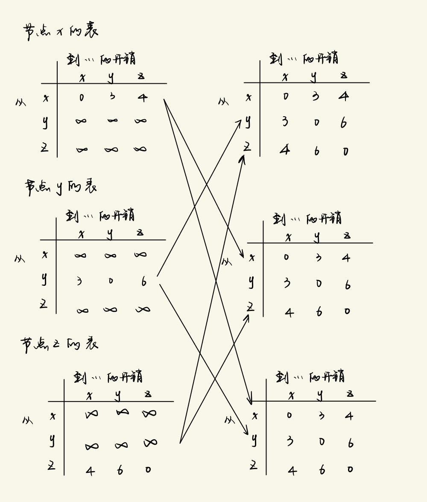

# 计网Homework5

## Q3

| 步骤 |  $N'$   | $D(y), p(y)$ | $D(z), p(z)$ | $D(v), p(v)$ | $D(w), p(w)$ | $D(t), p(t)$ | $D(u), p(u)$ |
| :--: | :-----: | :----------: | :----------: | :----------: | :----------: | :----------: | :----------: |
|  0   |   $x$   |    $6, x$    |    $8, x$    |    $3, x$    |    $6, x$    |   $\infty$   |   $\infty$   |
|  1   |  $x v$  |    $6, x$    |    $8, x$    |    $3, x$    |    $6, x$    |    $7, v$    |    $6, v$    |
|  2   |   xvy   |    $6, x$    |    $8, x$    |    $3, x$    |    $6, x$    |    $7, v$    |    $6, v$    |
|  3   |  xvyw   |    $6, x$    |    $8, x$    |    $3, x$    |    $6, x$    |    $7, v$    |    $6, v$    |
|  4   |  xvywu  |    $6, x$    |    $8, x$    |    $3, x$    |    $6, x$    |    $7, v$    |    $6, v$    |
|  5   | xvywut  |    $6, x$    |    $8, x$    |    $3, x$    |    $6, x$    |    $7, v$    |    $6, v$    |
|  6   | xvywutz |    $6, x$    |    $8, x$    |    $3, x$    |    $6, x$    |    $7, v$    |    $6, v$    |

## Q7

#### a. 

$D_x(w)=2, D_x(y)=4, D_x(u)=7$.

#### b. 

**分析c(x, y)的变化：**

- 当c(x, y)变化后，仍然大于等于1（即c(x, y) ≥ 1），从x到u的最小成本路径至少需要7的成本。在这种情况下，由于最小成本路径的总成本没有变化，因此x不会通知其邻居关于到u的最小成本路径的变化。
- 若c(x, y)降低到小于1（即c(x, y) = δ < 1），那么最小成本路径将经过y，其成本为δ + 6（6为y到u的成本）。在这种情况下，x将会通知其邻居这一新的最小成本路径。

**分析c(x, w)的变化：**

- 如果c(x, w)的值小于或等于6（即c(x, w) = ϵ ≤ 6），则到u的最小成本路径将通过w，其成本变为5 + ϵ。在这种情况下，x将通知其邻居这个新的最小成本。
- 当c(x, w)的值大于6（即c(x, w) = δ > 6），最小成本路径会通过y，总成本为11。在这种情况下，x也将通知其邻居这个新的最小成本。

#### c. 

根据题目b的分析，若c(x, y)的改变仍保持其值大于等于1，则x不会告知其邻居关于到达u的最小成本路径的更新；而c(x, w)的任何变化都将

导致x向其邻居通报新的最小成本路径的更新。

## Q8

## Q14

a. 节点3c接收到的BGP报文源自AS4，该报文从4c路由器上获得了前缀x的信息，并且穿越了两个AS，因此被识别为eBGP。

b. 节点3a接收到的BGP报文在AS3内部生成，并且是从3c路由器上学习到前缀x的，因此这是一个iBGP连接。

c. 节点1c接收到的BGP报文源自AS3，该报文从3a路由器上学习到了前缀x，并且穿越了两个AS到达1c，所以是eBGP。

d. 节点1d接收到的BGP报文在AS1内部生成，并且是从1c路由器上学习到前缀x的，因此这是一个iBGP连接。

## Q15

a.$I$将等于$I_1$。因为$1d$学到$x$要通过$1c$，而$I_1$通往$1d$到$1c$的最短路径。

b.$I$将设置为$I_2$。因为虽然通过$1b$和$1c$都可以到达$x$,且两条路径的都经过2个AS，$AS-PATH$相同，但是$1b$距离$1d$更近，也即$I_2$通往更近的路径，因此选择$I_2$。

c.$I$将设置为$I_1$。对于$I_1$通过$1c$只需要经过2个$AS$,但是对于$I_2$通过$1b$需要3个$AS$，$I_1$通往更短的路径，选择$I_1$。