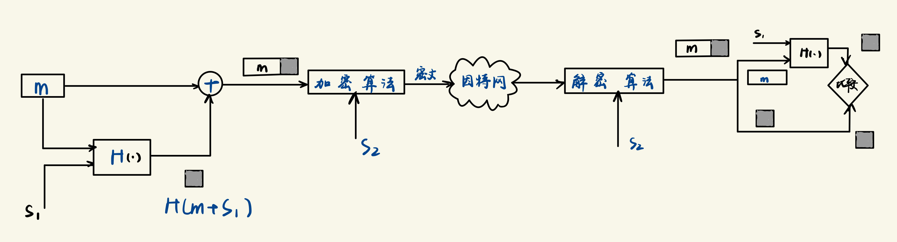
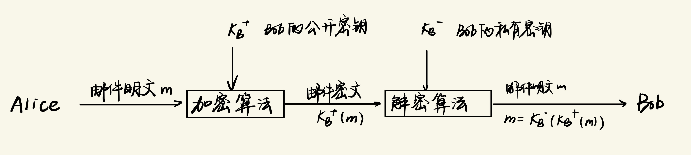

# 计网Homework8

PB21111723 王涵

## Q8

（1）$n=pq=5\times11=55$，$z=(p-1)(q-1)=4\times10=40$

（2）因为$e=3<n$，且$e$与$z$互质。

（3）$ed-1$可被$z$整除，$d = (40i+1)/3$, $i$为大于0的整数，保证$d$也为整数，取$i＝2$，$d=27$，取$i＝5$，$d=67$，取$i＝8$，$d=107$

（4）加密 $c=m^emod\mathrm{~}n=8^3mod\mathrm{~}55=17$

## Q12

## Q18

a.不能。由于 Alice 没有公钥私钥对并且仅持有 Bob 的公钥，她缺乏身份验证所需的工具。Alice 没有与 Bob 共享的特定报文认证密钥，如 s1，因此她无法通过加密手段证明自己的身份。由此，Bob 也无法确认收到的消息确实来自 Alice。

b.可以，只要Alice的报文经过Bob的公钥$K_B^+$加密，就可以实现机密传输，Bob收到之后可以用私钥解密。如下表示，

