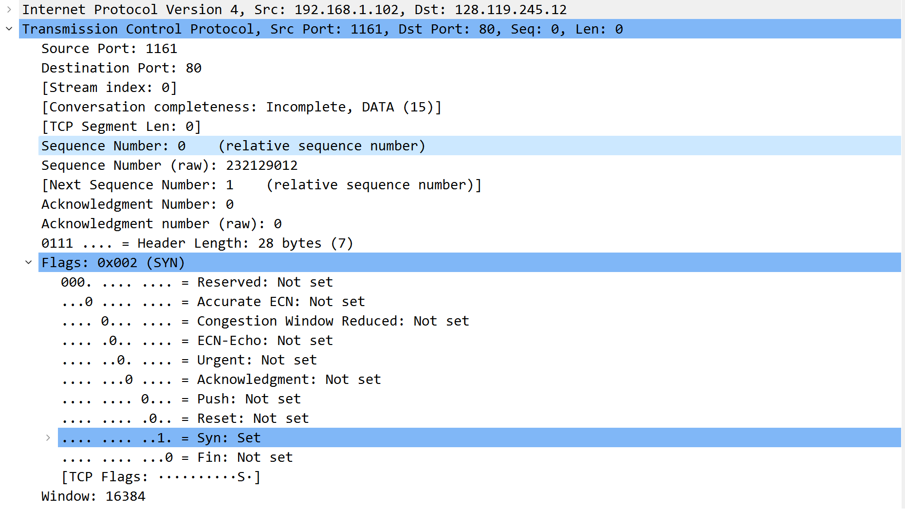

# Lab4 TCP

PB21111723 王涵

> 1.将文件传输到 gaia.cs.umass.edu 的客户端计算机（源）使用的 IP 地址和 TCP 端口号是什么？

使用实验文档中提供包tcp-ethereal-trace-1的截图，

ip：192.168.1.102

TCP端口号：1161

> 2.gaia.cs.umass.edu 的 IP 地址是什么？在哪个端口号上发送和接收此连接的 TCP 区段？

IP 地址：128.119.245.12

接收连接的端口号：80

> 3.用于在客户端计算机和 gaia.cs.umass.edu 之间启动 TCP 连接的 TCP SYN 区段的序列号是什么？将区段标识为 SYN 区段的区段有什么功能？

截图如下，

我的客户计算机使用的 IP 地址为 `202.141.186.70`, 端口号为 `50801`.

>4.用于在客户端计算机和 gaia.cs.umass.edu 之间启动 TCP 连接的TCP SYN网段的序号是多少? 段中标识该段为 SYN 段的内容是什么?

使用实验文档中提供包tcp-ethereal-trace-1的截图，

可以看出，序列号为`0`; 

Flags设置为`0x002` ，Syn字段设置为1（Syn:Set），Flags中只含Syn标志位表示它是 SYN 报文段.

>5.gaia.cs.umass.edu 发送给客户端计算机以回复 SYN 的 SYNACK 网段的序列号是多少? SYNACK 网段中Acknowledgement字段的值是多少? gaia.cs.umass.edu 如何确定该值? 该网段中标识该网段为 SYNACK 网段的内容是什么?

使用实验文档中提供包tcp-ethereal-trace-1的截图，

序列号为 `0`;

Acknowledgement字段值为`1`;

Acknowledgement字段的值等于客户发出的SYN序列号加 1 ; 

Flags 字段被设为`0x012`，Acknowledgement和Syn字段设置为1（Acknowledgement:Set && Syn:Set）,Flags中两个标志位都被设置，所以它是 SYNACK 报文；

> 6.包含 HTTP POST 命令的 TCP 网段的序列号是多少? 请注意，为了找到POST 命令，您需要深入 Wireshark 窗口底部的数据包内容字段，寻找DATA 字段中包含"POST"的数据段

使用实验文档中提供包tcp-ethereal-trace-1的截图，

序列号为`1`；

> 7.将包含 HTTP POST 的 TCP 段视为 TCP 连接中的第一个网段。连接中前六个段的序列号是多少?

使用实验文档中提供包tcp-ethereal-trace-1的截图，

这6个段分别对应编号为4,5,7,8,10,11的包,

 其ACK报文分别对应编号为6,9,12,14,15,16的包。

则由题意得，如下表所示

|        | No.  | 序号 | 报文发送时间 | 对应ACK No. | ACK 接收时间 |   RTT    | 接收到 ACK 报文后的 EstimatedRTT |
| :----: | :--: | :--: | :----------: | :---------: | :----------: | :------: | :------------------------------: |
| 报文 1 |  4   |  1   |   0.026477   |      6      |   0.053937   | 0.027460 |             0.027460             |
| 报文 2 |  5   | 566  |   0.041737   |      9      |   0.077294   | 0.035557 |             0.028472             |
| 报文 3 |  7   | 2026 |   0.054026   |     12      |   0.124085   | 0.070059 |             0.033670             |
| 报文 4 |  8   | 3486 |   0.054690   |     14      |   0.169118   | 0.114428 |             0.043765             |
| 报文 5 |  10  | 4946 |   0.077405   |     15      |   0.217299   | 0.139894 |             0.055781             |
| 报文 6 |  11  | 6406 |   0.078157   |     16      |   0.267802   | 0.189645 |             0.072514             |

> 8.前六个 TCP 网段的长度各是多少?

`565`, `1460`, `1460`, `1460`, `1460`, `1460` 字节。

> 9.在整个跟踪过程中，接收方的可用缓冲空间最小值是多少? 接收端缓冲空间不足是否会对发送端造成影响?

Calculated window size是5840最小可用缓冲区空间为 `5840` 字节。

接收方的缓冲区空间不会影响到发送端。因为接收方 buffer 一直有空间，并且请求方发送的 TCP 报文长度都小于buffer 剩余值，所以TCP段的可用空间总是多余的。

> 10.跟踪文件中有重发的文段吗? 为了回答这个问题，您 (在跟踪文件中) 检查了哪些内容?

没有重发的报文。可以观察Stevens图，随着时间推移，发送报文的序号严格递增，而如果有重发的报文，序号是会减少的。

> 11.接收方通常在一个 ACK 中确认多少数据? 您能否找出接收方每收到一个数据段就 ACK 一次的情况 (见正文第 250 页表 3.2) ?

接收方通常在一个ACK中确认1460字节的数据; 

可以找到题中所述的情况, No.60和No.61, Ack=37969和Ack=40889, 40889-37969=2920=1460*2，是最大报文段的二倍，满足条件。

> 12.TCP 连接的吞吐量 (单位时间内传输的字节数) 是多少? 请解释您是如何计算出这一数值的。

第一个有POST请求的TCP报文对应No.4，发送时间为0.026477s，Ack=1，

最后一个ACK对应No.202，接收时间为5.455830s，Ack=164091，

故吞吐量为$\frac{164091-1}{5.455830-0.026477}=\frac{164090}{5.429353}=30222.75B/s$

> 13.使用时间序列图Stevens绘图工具查看从客户端发送到gaia.cs.umass.edu 服务器的数据段的序列号与时间的关系图。您能确定TCP 的慢启动阶段在哪里开始和结束，以及拥塞避免在哪里接管吗? 请就测量数据与我们在课文中学习的理想化 TCP 行为的不同之处发表评论。

作Stevens图如下，从图中看到，TCP的慢启动阶段大致是在0~0.125s时间，后续在大约0.3s就进入拥塞避免阶段。

其与理想化的 TCP 行为不同的是，在慢启动后拥塞避免状态下，cwnd固定为一个常数6, 而不是线性增长.

> 14.就您从计算机向 gaia.cs.umass.edu 传输文件时收集到的痕迹，回答上述两个问题中的每个问题。

作Stevens图如下，容易看出，TCP的慢启动阶段大致是在0~1.3s时间内，1.3s后开始拥塞避免阶段。

其与理想化的 TCP 行为不同的是，在慢启动时并不是理想的指数增长；且拥塞避免状态下，cwnd固定为一个常数，而不是线性增长.

