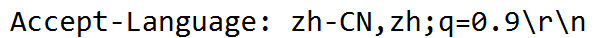
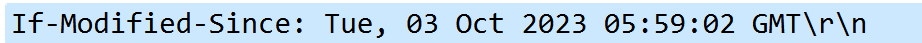
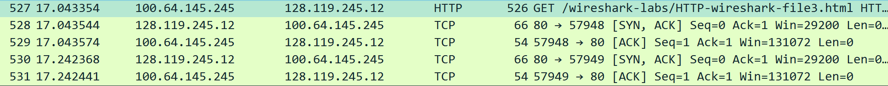
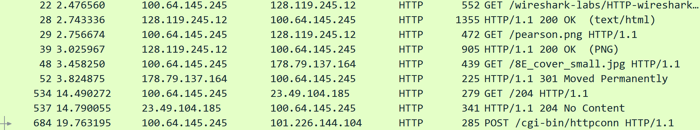
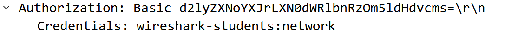

# 计网Lab2-HTTP

学号:PB21111723 姓名:王涵

 

## 问题解答

1.

HTTP/1.1；HTTP/1.1。

2.

简体中文 zh-CN

3.

100.64.145.245

128.119.245.12

4.

200表示找到该网页

5.

6.128字节

7.

8.没有看到。因为这是浏览器第一次请求该页面。

9.是。因为HTTP响应报文的实体中包含了返回文件的内容，这实体部分可以看到。

10.看到了。"**IF-MODIFIED-SINCE**"首部字段所指的时间与上一次HTTP响应中的**Last-Modified**字段所示的时间是匹配的。

11.

状态码304  短语Not Modified

没有明确返回文件内容，这是因为请求的文件在服务器端已被缓存。当服务器确认该文件未发生修改时，浏览器便直接使用了本地的缓存版本。

12.有1条GET请求。4个分组都包含了。

13.第一个分组。

14.状态：200 短语：OK

15.4个。

16.3个。都发往128.119.245.12。

17.串行。

实验中所捕捉到的数据包显示两张是串行下载的。观察图像可知，对于第一张的图像请求的数据包号是29，第二张图像的请求包号是48，而第一张图像的响应包号是39，第二张图像的响应包号是52，故可以此判断为串行进行的下载。

18.状态码：401；短语：Unauthorized。

19.HTTP-GET消息中包含新的字段"Authorization: Basic..."

