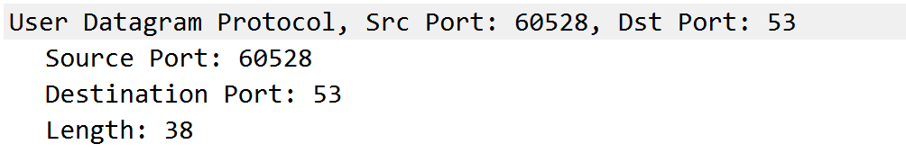
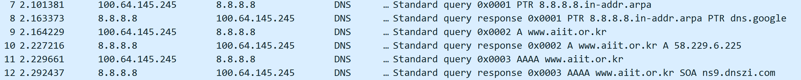

# 计网Lab3-DNS

学号：PB21111723 姓名：王涵

## 问题解答

**1.运行*nslookup*以获取一个亚洲的Web服务器的IP地址。该服务器的IP地址是什么？**

**2.运行*nslookup*来确定一个欧洲的大学的权威DNS服务器。**

**3.运行nslookup，使用问题2中一个已获得的DNS服务器，来查询Yahoo!邮箱的邮件服务器。它的IP地址是什么？**

雅虎找不到，难绷，换成助教在群里发的8.8.8.8

**4.找到DNS查询和响应报文。它们是否通过UDP或TCP发送？**

通过UDP发送。

**5.DNS查询消息的目标端口是什么？ DNS响应消息的源端口是什么？**

目标端口：53 源端口：60528

**6.DNS查询报文发送到哪个IP地址？使用ipconfig来确定本地DNS服务器的IP地址。这两个IP地址是否相同？**

发送到202.38.64.56

本地DNS服务器的ip地址是20.38.64.56，二者相同。

**7.检查DNS查询消息。DNS查询是什么"Type"的？查询消息是否包含任何"answers"？**

type A；没有answer。

**8.检查DNS响应消息。提供了多少个"answers"？这些答案具体包含什么？**

2个“answer”。

| Parameter        | Description                                                  |
| ---------------- | ------------------------------------------------------------ |
| **Name**         | 域名的名称，即 www.ietf.org                                  |
| **Type**         | 记录类型。                                                   |
| **Class**        | 记录类别，IN是Internet即互联网中的记录。                     |
| **Time to live** | 记录的生存时间，以秒为单位，这里是300秒（5分钟），表示这个记录在本地DNS缓存中可以保存5分钟。 |
| **Data length**  | 数据的长度，这里是4个字节。                                  |
| **Address**      | 给出ip的实际地址                                             |

**9.考虑从您主机发送的后续TCP SYN数据包。 SYN数据包的目的IP地址是否与DNS响应消息中提供的任何IP地址相对应？**

对应。

**10.这个网页包含一些图片。在获取每个图片前，您的主机是否都发出了新的DNS查询**

没有。

**11.DNS查询报文的目标端口是什么？ DNS响应报文的源端口是什么？**

查询报文：目标端口53

响应报文：源端口53

**12.DNS 查询消息的目标 IP 地址是什么？这是你的默认本地 DNS 服务器的 IP 地址吗？**

目标ip是202.38.64.56

本地DNS服务器ip也是202.38.64.56，是一样的。

**13.检查 DNS 查询消息。DNS 查询是什么 “Type” 的？查询消息是否包含任何 “answers”？**

Type:A.没有answer。

**14.检查DNS响应报文。提供了多少个"answers"？这些答案包含什么？**

3个。

包含了如下信息：

| Parameter        | Description                              |
| ---------------- | ---------------------------------------- |
| **Name**         | 域名                                     |
| **Type**         | 记录类型。A                              |
| **Class**        | 记录类别，IN是Internet即互联网中的记录。 |
| **Time to live** | 记录的生存时间，以秒为单位。             |
| **Data length**  | 数据的长度。                             |
| **Address**      | 给出ip地址                               |
| **CNAME**        | 规范名称的别名                           |

**15.提供屏幕截图。**

**16.NS查询报文发送到的IP地址是什么？这是您的默认本地DNS服务器的IP地址吗？**

发送到202.338.64.56，是我默认的DNS服务器的ip地址。

**17.检查DNS查询报文。DNS查询是什么"Type"的？查询报文是否包含任何"answers"？**

Type：NS，不包含answer。

**18.检查DNS响应报文。响应报文提供的MIT域名服务器是什么？此响应报文还提供了MIT域名服务器的IP地址吗？**

提供了八个域名服务器，没有ip地址。

**19.提供屏幕截图。**

20-23用nslookup www.aiit.or.kr bitsy.mit.edu超时换成了Google的DNS

**20.DNS查询报文发送到的IP地址是什么？这是您的默认本地DNS服务器的IP地址吗？如果不是，这个IP地址是什么？**

发送到了8.8.8.8，不是默认本地DNS服务器的IP地址，它是我设置的GoogleDNS

**21.检查DNS查询报文。DNS查询是什么"**Type**"的？查询消息是否包含任何"**answers**"？**

Type：A和AAAA

A:

AAAA:

**22.检查DNS响应报文。提供了多少个"**answers**"？这些答案包含什么？**

1个。

| Parameter        | Description                              |
| ---------------- | ---------------------------------------- |
| **Name**         | 域名                                     |
| **Type**         | 记录类型。A                              |
| **Class**        | 记录类别，IN是Internet即互联网中的记录。 |
| **Time to live** | 记录的生存时间，以秒为单位。             |
| **Data length**  | 数据的长度。                             |
| **Address**      | 给出ip地址                               |

**23.提供屏幕截图**

