# 计网lab5 IP

使用 http://gaia.cs.umass.edu/wireshark-labs/wireshark-traces.zip 提供的`ip-ethereal-trace-1`来回答问题

> Q1 您电脑的 IP 地址是什么?

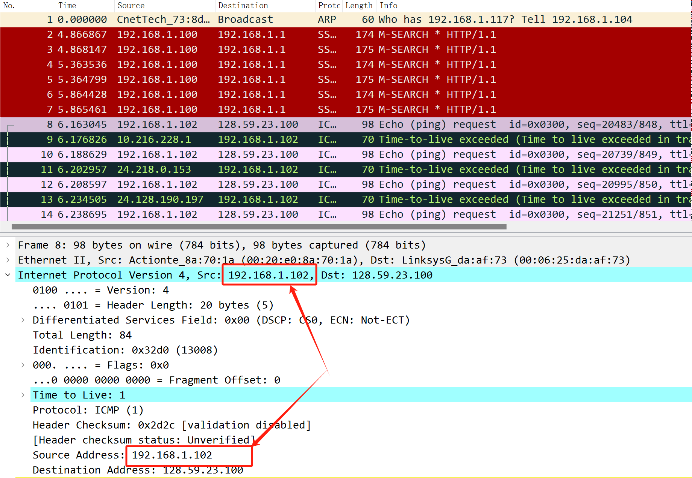

从第8个包的信息，可以看出电脑的ip地址是192.168.1.102

> Q2 在 IP 包头中，上层协议字段的值是什么?

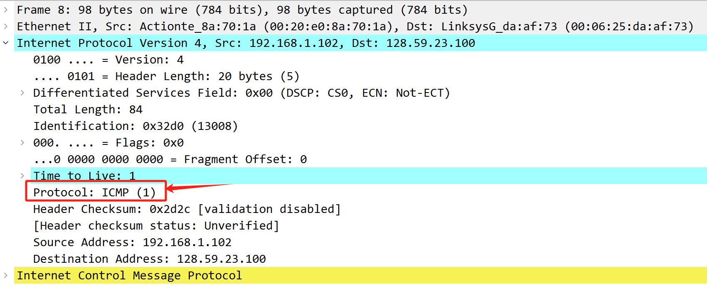

上层协议字段是ICMP(1)。

> Q3 IP报头有多少字节? IP数据报的有效载荷有多少字节? 解释你是如何确定有效载荷字节数的。

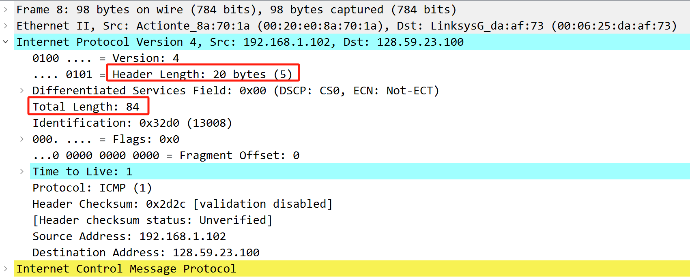

报头有20字节。

总长度84字节，所以有效载荷为 84 - 20 = 64 字节

> Q4 该IP数据报是否已被分片? 请解释您是如何确定数据报是否被分片的。

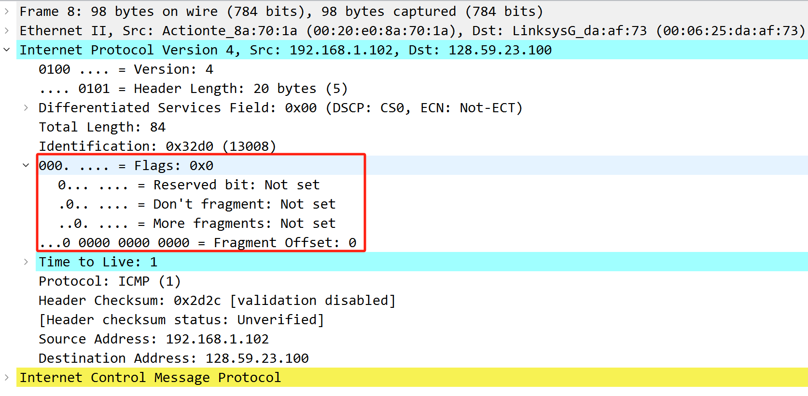

Flags设置为0x0，More fragments未设置，Fragment Offset也设置为0。

> Q5 在您的计算机发送的这一系列 ICMP 报文中，IP数据报中的哪些字段总是从一个数据报到下一个数据报不断变化?

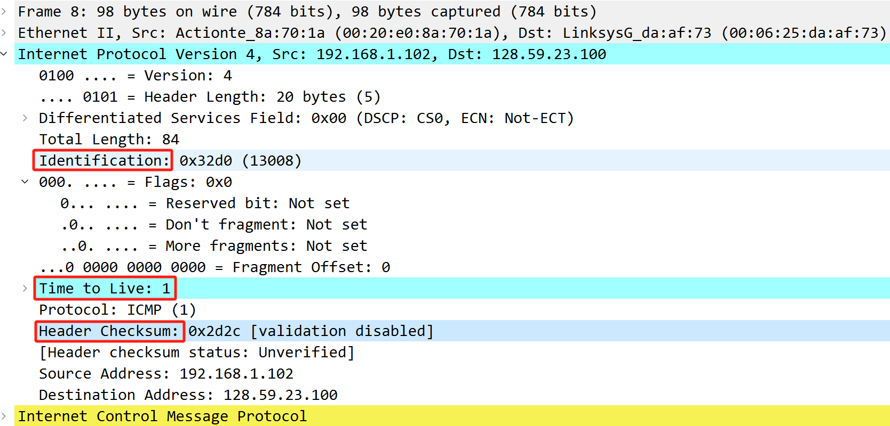

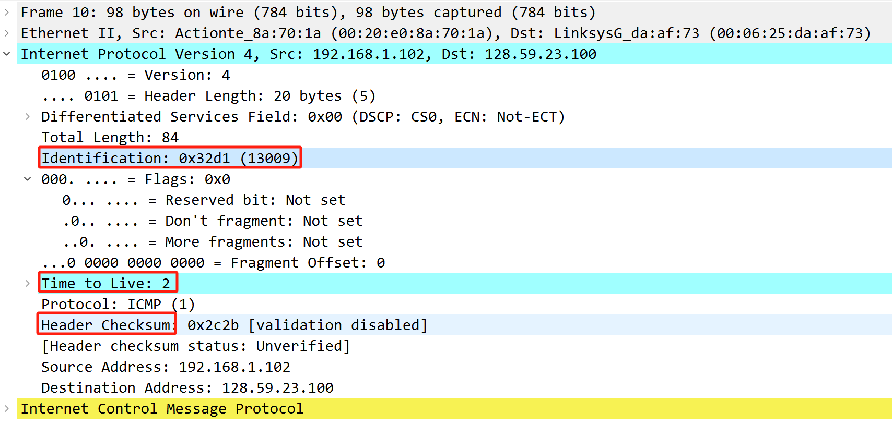

由图可知，不同的两个IP数据报的`Identification` 、`Time to Live` 、`Header Checksum`总是在变化

> Q6 哪些字段保持不变? 哪些字段必须保持不变? 哪些字段必须改变? 为什么？

1. 依旧对比Q5中的两张图，分析得到如下结论

2. 保持不变的字段:

   版本号 `Version`、首部长度 `Header Length`、区分服务 `Differentiated Services Field`、上层协议 `Protocol`、总长度 `Total Length`、标志 `Flags`、片段偏移 `Fragment Offset`、源地址 `Source Address`、目的地址 `Destination Address`

   对于所有数据报，以下字段必须保持不变：

   - `版本号 (Version)`：由于使用的是 IPv4，版本号保持不变。

   - `首部长度 (Header Length)`：鉴于数据报均无选项，其长度固定为 20 字节。

   - `区分服务 (Differentiated Services Field)`：所有数据报采用相同的服务类型。

   - `协议 (Protocol)`：全部数据报均为 ICMP 报文。

   - `源地址 (Source Address)`：审查的是来自同一源地址的报文。

   - `目的地址 (Destination Address)`：所有报文的目标地址相同。

   而以下字段根据情况发生变化：

   - `标识 (Identification)`：不同数据包具有独特的标识。
   - `首部校验和 (Header Checksum)`：由于其他字段变化，校验和也随之变动。
   - `存活时间 (Time to Live, TTL)`：traceroute 程序发送的报文中，TTL 值会递增，导致该字段变化。

> Q7 描述你在 IP 数据报的标识字段值中看到的模式。

每发送一个 ICMP Echo 报文时，标识（Identification）字段会递增 1

> Q8 标识字段和 TTL 字段的值是多少?

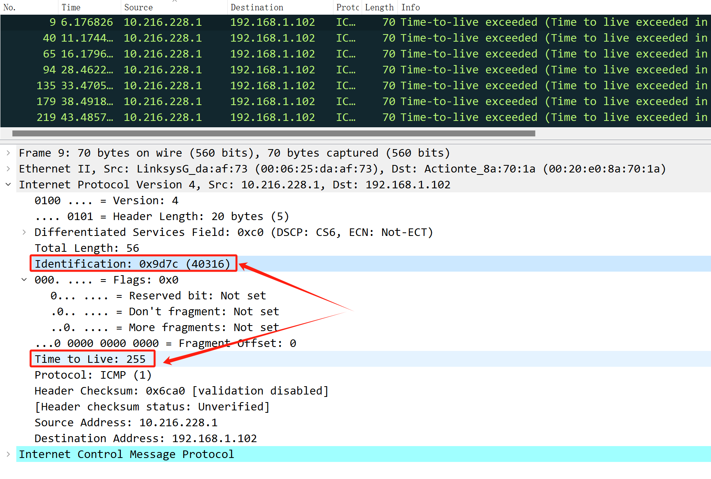

标志字段Identification为0x9d7c，TTL字段为255

> Q9 最近 (第一跳) 路由器向您的计算机发送的所有 ICMP TTL 超标回复中，这些值是否保持不变? 为什么?

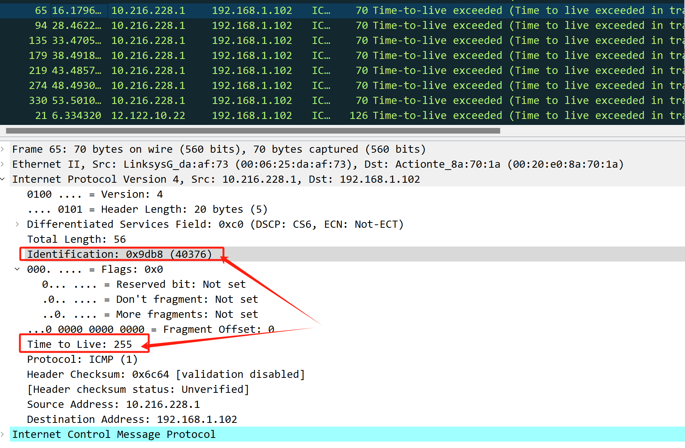

对比上图和Q8中的图发现，标识字段Identification每次都改变, 因为每个不同数据报都有不同的标识，所以会一直变化；

TTL 字段保持不变, 鉴于每个数据包的Identification值是唯一的，同时它们抵达同一服务器的跳数相等，且服务器配置一致，路由器处理数据报时 TTL 才会减 1，因此它们的TTL值保持恒定不变。

> Q10 将pingplotter 中的“数据包大小”改为 2000 后，查找计算机发送的第一条ICMP Echo Request 报文。该报文是否被多个 IP 数据报分片?

包序号93如下：

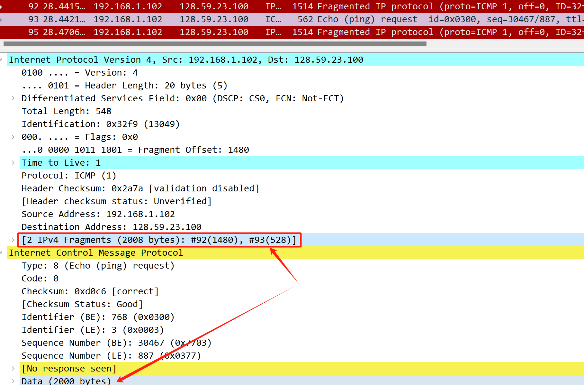

包序号92如下：

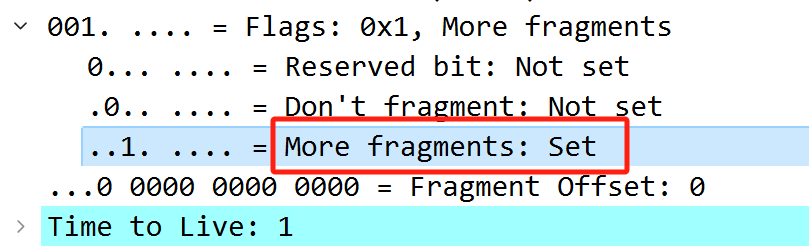

从两张截图看出来，确实发生了分片。

> Q11 打印出分片 IP 数据报的第一个片段。IP 报头中的哪些信息表明数据报已被分片? IP 报头中的哪些信息表明这是第一个片段还是后一个片段? 该IP数据报有多长?

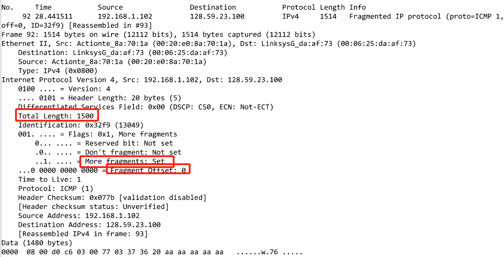

`More Fragments`被设置表示已分片；

片位移`Fragment Offset`是0，表示这是第一个片；

`Total Length = 1500`,数据报长度为1500字节。

> Q12 打印出分片 IP 数据报的第二个片段。IP 报头中的哪些信息表明这不是第一个数据报片段? 是否有更多片段? 如何判断?

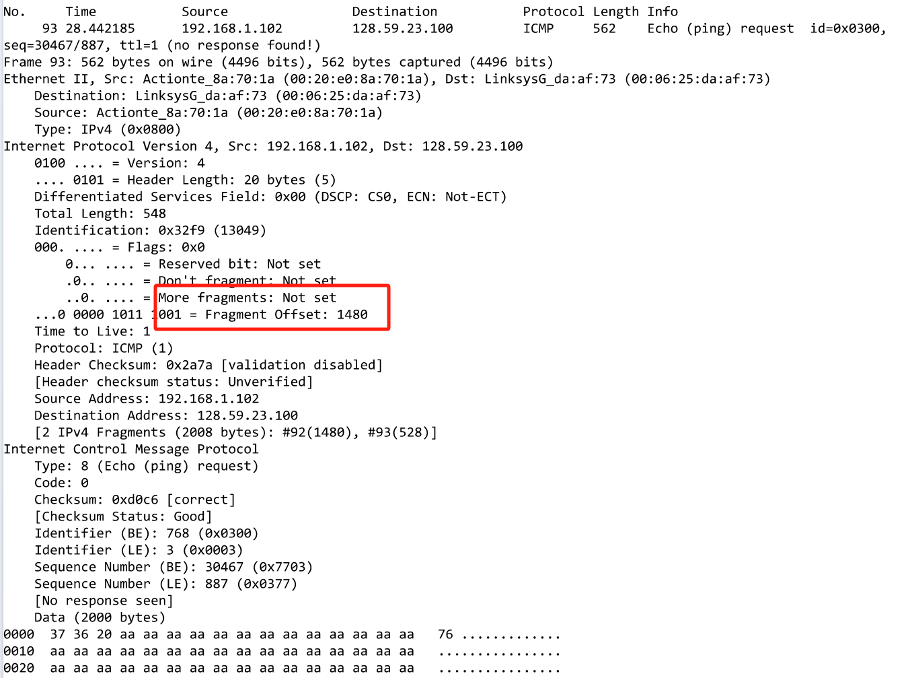

`Fragment Offset`字段表示为 1480 表明它不是第一个片段，`More fragments`为Not Set可以知道没有更多片段了。

> Q13 在第一个片段和第二个片段之间，IP标头的哪些字段发生了变化?

从Q11、Q12打印截图中分析得到，`Total Length` 、`More fragments` 、 `Fragment Offset` 、 `Header Checksum` 发生了变化。

> Q14 从原始数据报生成了多少个片段?

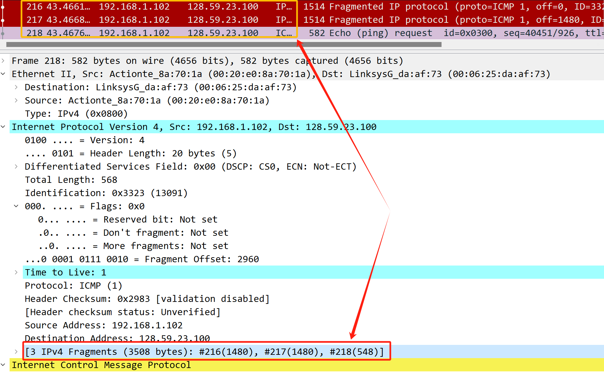

包序号216、217、218，在包218的信息中看到原始数据报被分成了3个片段。

> Q15 片段之间 IP 标头的哪些字段会发生变化?

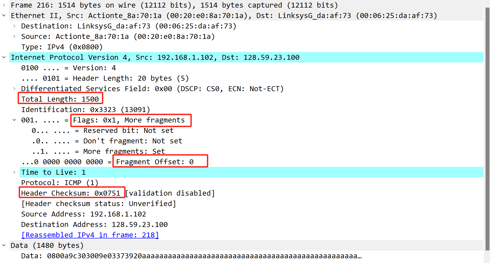

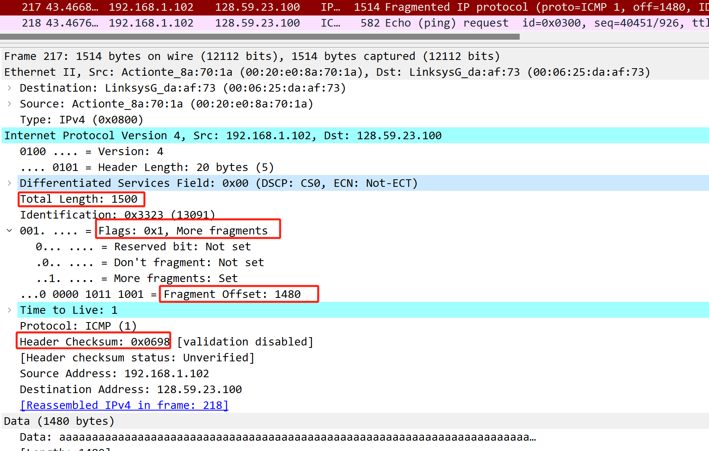

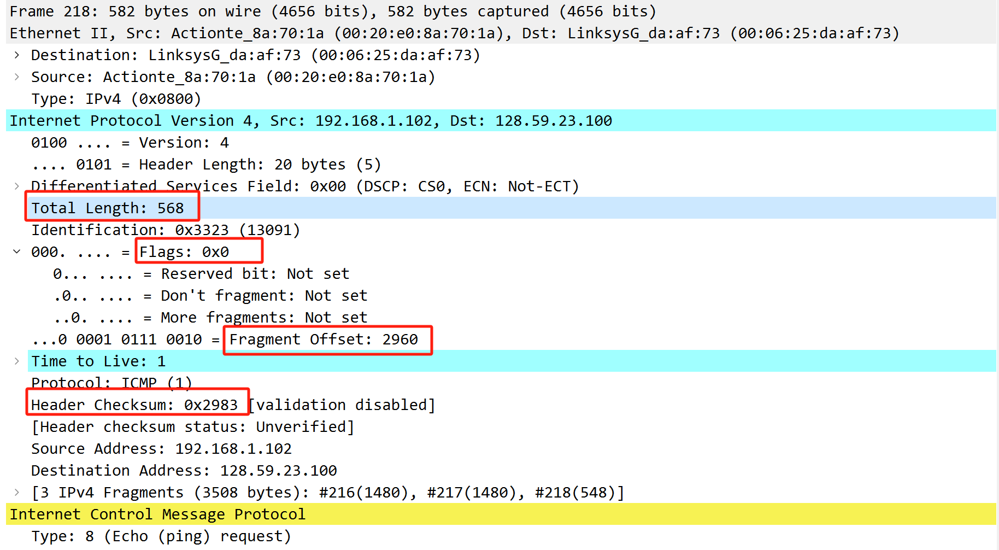

对比上面三张截图发生变化的字段：

- 数据报长度 `Total Length`, 

- 标志 `Flags`, 

- 片偏移 `Fragment Offset` 

- 首部校验和 `Header Checksum` 