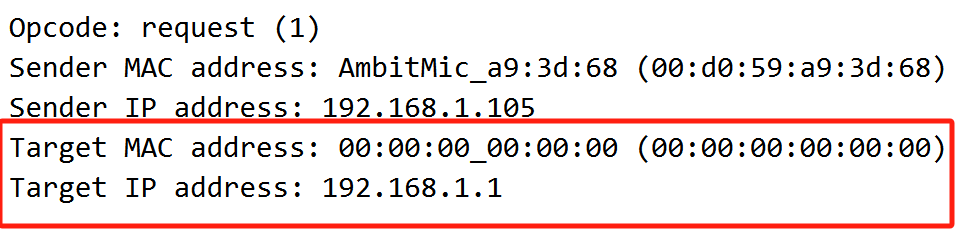

# 计网实验6

PB21111723 王涵

PS：使用实验提供的的ethernet-ethereal-trace-1来回答问题完成实验报告

## Q1

您的计算机的48位以太网地址是什么？

------

得到以太网地址是`00:d0:59:a9:3d:68`

## Q2

以太网帧中的 48 位目标地址是什么？这是 gaia.cs.umass.edu 的以太网地址吗？（提示：答案是否定的）。那么它是什么?注意这一题可能会犯错，请阅读 468-469(中文版 305-308 页)然后理解它。

------

- 以太网帧中的 48 位目标地址是 `00:06:25:da:af:73`
- 该地址不是gaia.cs.umass.edu的以太网地址。
- 它是路由器的地址，这是用于出子网的链路，属于主机连接到路由器的接口。

## Q3

以太网帧上层协议 16 进制值是什么?这对应的上层协议是什么？

------

- 16进制值是0x800
- 对应上层协议IPv4

## Q4

从以太帧的开始，一直到“GET”中的 ASCII“G”出现在以太网帧中为止，有多少字节？

------

- `G`的ASCII码是`47`
- `47`出现在第55bytes的位置
- 那么`G`之前已经有了54bytes

## Q5

这个以太网帧中，以太网源地址的值是多少？这是你的计算机的地址，还是gaia.cs.umass.edu 的地址（提示：答案是否定的）。拥有这个以太网地址的设备是什么？

------

- 以太网源地址的值是`00:06:25:da:af:73`
- 不是计算机的地址，也不是gaia.cs.umass.edu 的地址
- 这是主机的子网路由器地址

## Q6

以太网帧中的目的地址是什么？这是您的计算机的以太网地址吗？

------

- 以太网帧中的目的地址是`00:d0:59:a9:3d:68`
- 这是计算机的以太网地址

## Q7

以太网帧上层协议 16 进制值是什么?这对应的上层协议是什么？

------

- 以太网帧上层协议 16 进制值：0x800

- IPv4协议

## Q8

从以太帧的开始，一直到“OK”中的 ASCII“O”出现在以太网帧中为止，有多少字节？

------

- `O`的ASCII码是`4f`
- `4f`出现在第68bytes的位置
- 那么`O`之前已经有了67bytes

## Q9

写下计算机 ARP 缓存的内容。每个列值的含义是什么？

------

- Internet地址列意即IP地址

- 物理地址列意即MAC地址

- 类型有动态和静态之分：

  动态是指在一定的时间内某个表项没有被使用就会被系统删除；静态是指表项会被永久保存。

## Q10

包含 ARP 请求消息的以太网帧中源和目标地址的十六进制值是什么？

------

- 源地址是 `00:d0:59:a9:3d:68`
- 目标地址是` ff:ff:ff:ff:ff:ff `

## Q11

为双字节以太网帧类型字段提供十六进制值。这对应于什么上层协议？

------

- 0x0806
- ARP协议

## Q12

a)ARP 操作码字段开始从以太网帧的最开始有多少字节？

b)在进行 ARP 请求的以太网帧的 ARP 负载部分中，操作码字段的值是多少？

c)ARP 消息是否包含发送方的 IP 地址？

d)在 ARP 请求中从哪里看出我们要查询相应 IP 的以太网地址?

------

a)

距离以太网帧最开始 20 个字节。

b)进行 ARP 请求的以太网帧的 ARP 负载部分中的操作码的值为1

c)

包含，如图所示包含发送方的 IP 地址 `192.168.1.105`

d)

如图所示，Target MAC address字段设置为`00：00：00：00：00：00`来对其对应的IP地址`192.168.1.1`提问。

## Q13

a)ARP 操作码字段开始从以太网帧的最开始有多少字节？

b)在进行 ARP 响应的以太网帧的 ARP 负载部分中，操作码字段的值是多少？

c)在响应 ARP 中从哪里看出现早期 ARP 请求的答案?

------

a)

ARP 操作码字段开始从以太网帧的最开始有20字节。

b)

操作码字段2

c)从图中看到，

- Target MAC address 为 `00:d0:59:a9:3d:68`
- Target IP address 为 `192.168.1.105`
- 这与之前的ARP Sender MAC address、 Sender IP address 是照应的

## Q14

包含 ARP 回复消息的以太网帧中的源地址和目标地址的十六进制值是多少？

------

- 源地址：` 00:06:25:da:af:73`
- 目的地址 ： `00:d0:59:a9:3d:68 `

## Q15

------

ARP请求是广播的，子网中所有主机都能收到。这个ARP请求没有回复，因为我们不在发送请求的计算机上，回复只能被发送该广播的计算机接受。

## EX-1

arp 命令：`arp -s` InetAddr EtherAddr 允许您手动向 ARP 缓存添加一个条目，该条目将 IP 地址 InetAddr 解析为物理地址 EtherAddr。如果在手动添加条目时，输入了正确的 IP 地址，但该远程接口的以太网地址错误，会发生什么情况？

------

会使本地主机无法访问这个IP地址

## EX-2

删除条目之前，条目在 ARP 缓存中保留的默认时间是多少。 您可以根据经验（通过监视缓存内容）或通过在操作系统文档中查找来确定这一点。 指出您如何/在何处确定该值。

------

我使用的是Windows系统，因此查询Microsoft的官方文档[地址解析协议缓存行为 - Windows Server | Microsoft Learn](https://learn.microsoft.com/zh-cn/troubleshoot/windows-server/networking/address-resolution-protocol-arp-caching-behavior)得到结论：

介于15~45s，而接下来通过netsh interface ipv4 show interface 18命令可以查询基本访问时间如下：

ARP cache的生存时间，基本可访问时间为 30000 毫秒，即30秒，正好介于15~45s。

